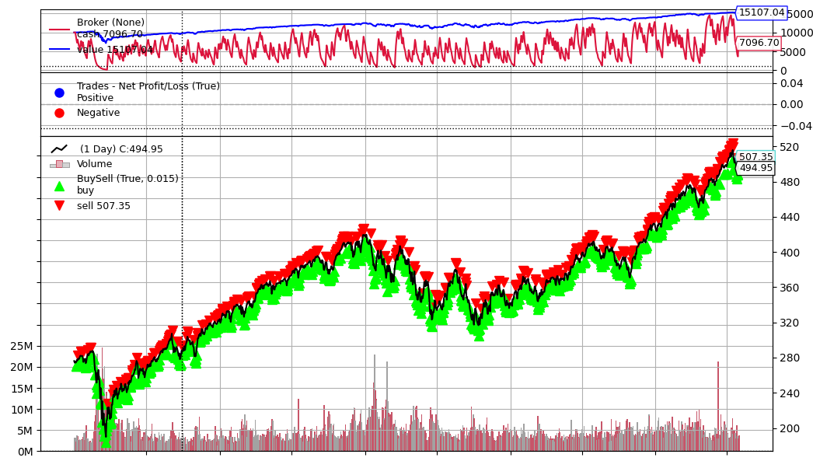

# Simple Trader

This project contains a simple trader that uses the ALPACA API to trade on the stock market using a paper account or a real account.

It does not trade options, but rather trades stocks. To avoid becoming a day trader, the trader will only make one trade every 2 days (either a BUY or a SELL Market Order).

It can also only trade one stock, though the code can easily be modified to trade multiple stocks.

## Getting Started

1. To get started, you will need to create an account on the Alpaca Trading website and get your API keys.
2. Clone this repository and install the required packages by running the following command:

```bash
pip install -r requirements.txt
```

3. Create a file called `config.py` in the root directory of the project with the following contents:

```python
PAPER = True # Set to True if you want to use a paper account
PAPER_ALPACA_API_KEY_ID = "Your API Key"
PAPER_ALPACA_API_SECRET_KEY = "Your Secret Key"
ALPACA_API_KEY_ID = "Your API Key"
ALPACA_API_SECRET_KEY = "Your Secret Key"
SYMBOL = "VOO" # The stock symbol you want to trade
```

3. Update the config file with your API keys and the stock symbol you want to trade.
4. Finally, you can run the trader by running the following command:

```python
./trade
```

This will run the trading bot which makes one trade per day based on the `make_decision()` function in `trader.py`. The strategy is currently just a placeholder that uses a 5 and 20 day moving average crossover strategy.

## Testing

Run the trader like before. But this time, you can set `quick_test` to `True` in the `trade` file to make it trade every minute. This is useful for testing your strategy since you can see the results quickly and it will work during non-market hours.

You can also modify `max_wait` to change how many seconds it will wait for a trade to complete.

## Strategy

To update the trading strategy, you need to modify the `make_decision()` function in `trader.py`. This function should return either `BUY` or `SELL` based on your strategy. You can use the `data` object to get historical data for the stock you are trading. Please see the function documentation for more details.

## Back Testing

Assuming you've written a strategy, you can backtest it using the `backtest.py` script. This script will run your strategy on historical data and give you the results. You can run the script using the following command:

```python
./backtest --start_date 2020-01-01 --end_date 2024-07-31 --symbol VOO
```

Note: of course, ff you have changed the input parameters (which you likely will do) for the `make_decision()` function, you will need to update the Trader to correctly pass the data to the function. For backtesting, this means you also need to update the `next()` function in `backtest.py`.

Once you have made your changes and verified the code is working, you can run the backtest script to see how your strategy would have performed in the past using a graph! Here is the graph generated by the default strategy for VOO (surprisingly, it doesn't perform terribly):



## Disclaimer

This project is for educational purposes only and should not be used to trade real money. The author is not responsible for any losses incurred by using this software.
